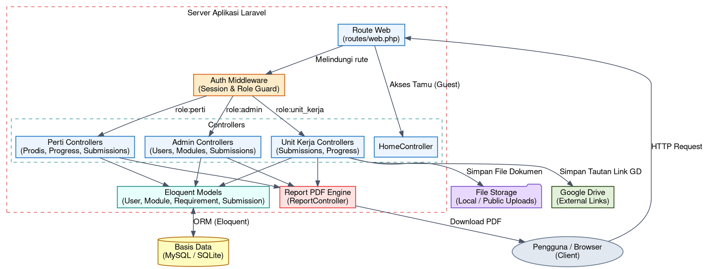

# Software Architecture Document (SAD)
## Sistem Manajemen & Pemantauan Dokumen Persyaratan (Akreditasi)

Dokumen ini mendeskripsikan arsitektur sistem, struktur komponen, aliran data, dan desain pola interaksi untuk sistem pemantauan dokumen persyaratan.

---

### 1. Arsitektur Tingkat Tinggi (High-Level Architecture)
Aplikasi ini dibangun menggunakan framework **Laravel** dengan pola arsitektur **MVC (Model-View-Controller)**. Seluruh logika akses dikontrol oleh middleware berbasis peran (*role-based middleware*).

Berikut adalah diagram blok arsitektur sistem (digambarkan dengan Graphviz):

---

### 2. Alur Proses Bisnis Pengumpulan Dokumen (Workflow)
Proses bisnis pengumpulan dokumen dan verifikasi digambarkan melalui alur berikut:

1. **Admin** membuat modul kriteria dan butir-butir persyaratan dokumen.
2. **Unit Kerja (Prodi)** masuk ke dashboard, melihat daftar persyaratan, lalu mengunggah berkas atau memasukkan tautan Google Drive.
3. Sistem memperbarui status pengunggahan menjadi `Terunggah` (`uploaded`), mencatat metadata file, versi, serta menandai berkas terbaru dengan `is_latest = true`.
4. **Perti (Perguruan Tinggi)** dan **Admin** memantau progres tersebut secara langsung melalui dashboard interaktif dan dapat mengunduh dokumen.

Berikut diagram alur unggah dan verifikasi dokumen (digambarkan dengan Graphviz):

```dot
digraph G {
  fontname="Helvetica,Arial,sans-serif"
  node [fontname="Helvetica,Arial,sans-serif" shape=box style=filled fillcolor="#F7FAFC" color="#CBD5E0" penwidth=1.5]
  edge [fontname="Helvetica,Arial,sans-serif" color="#4A5568" penwidth=1.2]
  
  rankdir=LR;
  
  Start [label="Mulai" shape=ellipse fillcolor="#C6F6D5" color="#38A169"]
  UploadReq [label="Unit Kerja memilih\nbutir persyaratan"]
  SubmitForm [label="Pilih File / Tautan GD\ndan klik Unggah"]
  CheckExist [label="Apakah dokumen\nsebelumnya ada?" shape=diamond fillcolor="#FEFCBF" color="#B7791F"]
  SetOldVersion [label="Ubah dokumen lama\nis_latest = false"]
  SaveNew [label="Simpan dokumen baru\nis_latest = true\nstatus = Uploaded"]
  UpdateProgress [label="Update % Progres\npada Dashboard"]
  End [label="Selesai" shape=ellipse fillcolor="#FED7D7" color="#E53E3E"]
  
  Start -> UploadReq
  UploadReq -> SubmitForm
  SubmitForm -> CheckExist
  CheckExist -> SetOldVersion [label="Ya"]
  CheckExist -> SaveNew [label="Tidak"]
  SetOldVersion -> SaveNew
  SaveNew -> UpdateProgress
  UpdateProgress -> End
}
```

---

### 3. Struktur Direktori Utama Proyek
Aplikasi ini mengikuti struktur direktori Laravel standar dengan struktur modul khusus di dalam folder `Controllers`:

- `app/Http/Controllers/`
  - `Admin/` : Mengelola data master (User, Modul, Kriteria, Diskusi, Laporan).
  - `Perti/` : Mengelola dan memantau Prodi serta rekapitulasi progres.
  - `UnitKerja/` : Mengelola pengumpulan dokumen dan rekapitulasi progres mandiri.
- `app/Models/` : Berisi model Eloquent (`User`, `Module`, `Requirement`, `Submission`, `Discussion`).
- `resources/views/` : Berisi template Blade untuk antarmuka pengguna yang terbagi berdasarkan masing-masing peran.
