# Database Schema & ERD
## Sistem Manajemen & Pemantauan Dokumen Persyaratan (Akreditasi)

Dokumen ini menjelaskan rancangan basis data sistem, detail kolom untuk masing-masing tabel, tipe data, serta hubungan antar-tabel (relasi).

---

### 1. Entity Relationship Diagram (ERD)
Berikut adalah diagram hubungan entitas (ERD) dari basis data sistem, digambarkan menggunakan Graphviz:

```dot
digraph G {
  fontname="Helvetica,Arial,sans-serif"
  node [fontname="Helvetica,Arial,sans-serif" shape=none]
  edge [fontname="Helvetica,Arial,sans-serif" color="#4A5568" penwidth=1.2]
  
  rankdir=LR;

  // Tabel Users
  users [label=<
    <table border="0" cellborder="1" cellspacing="0" bgcolor="#EBF4FF" color="#3182CE">
      <tr><td bgcolor="#3182CE" align="center"><font color="#FFFFFF"><b>users</b></font></td></tr>
      <tr><td align="left">PK | id : bigint (unsigned)</td></tr>
      <tr><td align="left">    name : varchar</td></tr>
      <tr><td align="left">    email : varchar (unique)</td></tr>
      <tr><td align="left">    role : varchar (admin / perti / unit_kerja)</td></tr>
      <tr><td align="left">    password : varchar</td></tr>
      <tr><td align="left">    profile_photo_path : varchar (nullable)</td></tr>
      <tr><td align="left">FK | perti_id : bigint (unsigned, nullable)</td></tr>
      <tr><td align="left">    timestamps</td></tr>
    </table>
  >];

  // Tabel Modules
  modules [label=<
    <table border="0" cellborder="1" cellspacing="0" bgcolor="#E6FFFA" color="#319795">
      <tr><td bgcolor="#319795" align="center"><font color="#FFFFFF"><b>modules</b></font></td></tr>
      <tr><td align="left">PK | id : bigint (unsigned)</td></tr>
      <tr><td align="left">    name : varchar</td></tr>
      <tr><td align="left">    description : text (nullable)</td></tr>
      <tr><td align="left">    sort_order : int</td></tr>
      <tr><td align="left">    timestamps</td></tr>
    </table>
  >];

  // Tabel Requirements
  requirements [label=<
    <table border="0" cellborder="1" cellspacing="0" bgcolor="#E6FFFA" color="#319795">
      <tr><td bgcolor="#319795" align="center"><font color="#FFFFFF"><b>requirements</b></font></td></tr>
      <tr><td align="left">PK | id : bigint (unsigned)</td></tr>
      <tr><td align="left">FK | module_id : bigint (unsigned)</td></tr>
      <tr><td align="left">    title : varchar</td></tr>
      <tr><td align="left">    description : text (nullable)</td></tr>
      <tr><td align="left">    sort_order : int</td></tr>
      <tr><td align="left">    timestamps</td></tr>
    </table>
  >];

  // Tabel Submissions
  submissions [label=<
    <table border="0" cellborder="1" cellspacing="0" bgcolor="#FFF5F5" color="#E53E3E">
      <tr><td bgcolor="#E53E3E" align="center"><font color="#FFFFFF"><b>submissions</b></font></td></tr>
      <tr><td align="left">PK | id : bigint (unsigned)</td></tr>
      <tr><td align="left">FK | requirement_id : bigint (unsigned)</td></tr>
      <tr><td align="left">FK | user_id : bigint (unsigned)</td></tr>
      <tr><td align="left">    file_path : varchar (nullable)</td></tr>
      <tr><td align="left">    original_filename : varchar (nullable)</td></tr>
      <tr><td align="left">    mime_type : varchar (nullable)</td></tr>
      <tr><td align="left">    file_size : bigint (nullable)</td></tr>
      <tr><td align="left">    status : varchar (pending / uploaded)</td></tr>
      <tr><td align="left">    version : int</td></tr>
      <tr><td align="left">    is_latest : boolean</td></tr>
      <tr><td align="left">    google_drive_links : json (nullable)</td></tr>
      <tr><td align="left">    files : json (nullable)</td></tr>
      <tr><td align="left">    timestamps</td></tr>
    </table>
  >];

  // Tabel Discussions
  discussions [label=<
    <table border="0" cellborder="1" cellspacing="0" bgcolor="#FEFCBF" color="#B7791F">
      <tr><td bgcolor="#B7791F" align="center"><font color="#FFFFFF"><b>discussions</b></font></td></tr>
      <tr><td align="left">PK | id : bigint (unsigned)</td></tr>
      <tr><td align="left">    nama : varchar</td></tr>
      <tr><td align="left">    email : varchar</td></tr>
      <tr><td align="left">    whatsapp : varchar</td></tr>
      <tr><td align="left">    perusahaan : varchar</td></tr>
      <tr><td align="left">    jabatan : varchar</td></tr>
      <tr><td align="left">    kebutuhan : json</td></tr>
      <tr><td align="left">    kebutuhan_lainnya : text (nullable)</td></tr>
      <tr><td align="left">    sistem_saat_ini : varchar</td></tr>
      <tr><td align="left">    investasi : varchar</td></tr>
      <tr><td align="left">    timestamps</td></tr>
    </table>
  >];

  // Relasi
  users -> users [label="1 to N (perti_id -> id)" color="#3182CE" constraint=false]
  modules -> requirements [label="1 to N (id -> module_id)" color="#319795"]
  requirements -> submissions [label="1 to N (id -> requirement_id)" color="#E53E3E"]
  users -> submissions [label="1 to N (id -> user_id)" color="#E53E3E"]
}
```

---

### 2. Deskripsi Struktur Tabel

#### 2.1 Tabel `users`
Menyimpan informasi pengguna sistem. Aktor bertindak sebagai `admin`, `perti` (Perguruan Tinggi), atau `unit_kerja` (Program Studi). Program studi dihubungkan ke perguruan tinggi asalnya melalui `perti_id`.

- `id` (bigint, Primary Key): ID unik pengguna.
- `name` (varchar): Nama lengkap pengguna atau nama institusi/program studi.
- `email` (varchar, Unique): Alamat email pengguna untuk login.
- `role` (varchar): Peran akses (`admin`, `perti`, `unit_kerja`).
- `password` (varchar): Kata sandi terenkripsi (bcrypt).
- `profile_photo_path` (varchar, Nullable): Lokasi penyimpanan foto profil pengguna.
- `perti_id` (bigint, Nullable, Foreign Key -> `users.id`): Menghubungkan unit kerja/prodi ke akun perguruan tinggi induknya.
- `created_at` & `updated_at`: Waktu pembuatan dan pembaruan record.

#### 2.2 Tabel `modules`
Menyimpan data kriteria utama pengelompokan persyaratan akreditasi (contoh: Kriteria 1: Visi, Misi, Tujuan, dan Strategi).

- `id` (bigint, Primary Key): ID unik modul.
- `name` (varchar): Nama modul/kriteria.
- `description` (text, Nullable): Penjelasan singkat mengenai modul.
- `sort_order` (int): Urutan tampilan modul pada halaman progres.

#### 2.3 Tabel `requirements`
Menyimpan butir-butir persyaratan spesifik yang ada di bawah setiap kriteria/modul.

- `id` (bigint, Primary Key): ID unik butir persyaratan.
- `module_id` (bigint, Foreign Key -> `modules.id`): ID modul tempat butir ini berada.
- `title` (varchar): Nama/judul persyaratan.
- `description` (text, Nullable): Instruksi atau penjelasan dokumen yang harus dikumpulkan.
- `sort_order` (int): Urutan tampilan di dalam modul terkait.

#### 2.4 Tabel `submissions`
Menyimpan dokumen dan tautan yang diunggah oleh Program Studi (Unit Kerja) untuk butir persyaratan tertentu. Tabel ini mendukung versioning berkas dan penyimpanan berkas ganda.

- `id` (bigint, Primary Key): ID unik berkas unggahan.
- `requirement_id` (bigint, Foreign Key -> `requirements.id`): ID persyaratan yang dipenuhi.
- `user_id` (bigint, Foreign Key -> `users.id`): ID program studi yang mengunggah.
- `file_path` (varchar, Nullable): Lokasi file utama di server lokal/cloud.
- `original_filename` (varchar, Nullable): Nama asli berkas saat diunggah.
- `mime_type` (varchar, Nullable): Tipe format berkas (misal: `application/pdf`).
- `file_size` (bigint, Nullable): Ukuran berkas dalam bytes.
- `status` (varchar): Status berkas (`pending` / `uploaded`).
- `version` (int): Nomor versi pengumpulan berkas (dimulai dari 1).
- `is_latest` (boolean): Flag penanda apakah record ini adalah versi terbaru yang valid (hanya ada satu `is_latest = true` per program studi dan persyaratan).
- `google_drive_links` (json, Nullable): Array tautan eksternal Google Drive.
- `files` (json, Nullable): Data terstruktur apabila ada beberapa berkas yang diunggah sekaligus (*batch*).

#### 2.5 Tabel `discussions`
Menyimpan data prospek atau pengajuan konsultasi diskusi yang diisi oleh pengunjung/publik melalui landing page.

- `id` (bigint, Primary Key): ID unik record diskusi.
- `nama` (varchar): Nama pengaju konsultasi.
- `email` (varchar): Alamat email pengaju.
- `whatsapp` (varchar): Nomor kontak WhatsApp aktif.
- `perusahaan` (varchar): Nama institusi/perusahaan asal.
- `jabatan` (varchar): Jabatan pengaju di institusinya.
- `kebutuhan` (json): Daftar kebutuhan sistem yang dipilih (berupa opsi ganda).
- `kebutuhan_lainnya` (text, Nullable): Keterangan kebutuhan tambahan.
- `sistem_saat_ini` (varchar): Status sistem informasi yang saat ini berjalan di institusi terkait.
- `investasi` (varchar): Rencana ketersediaan anggaran investasi sistem.
