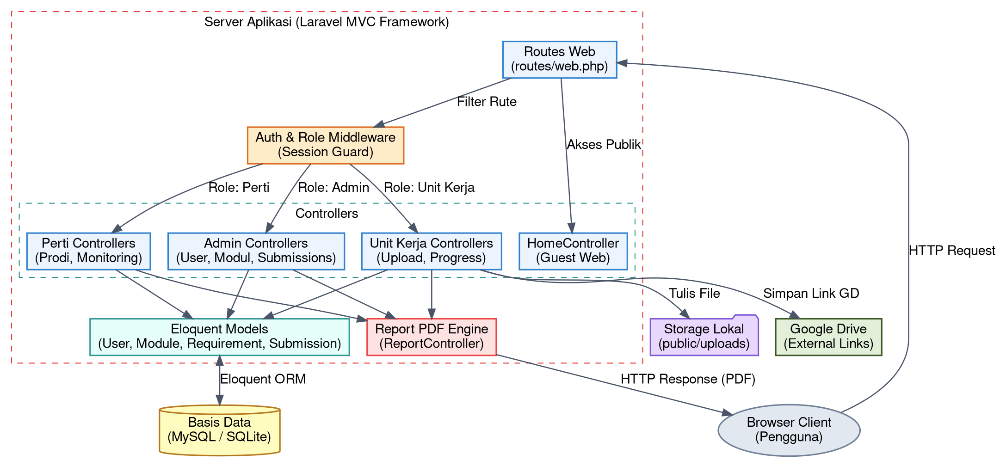
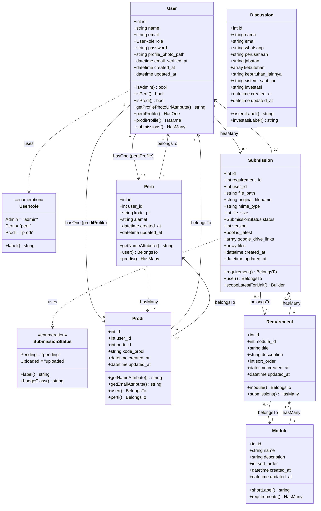
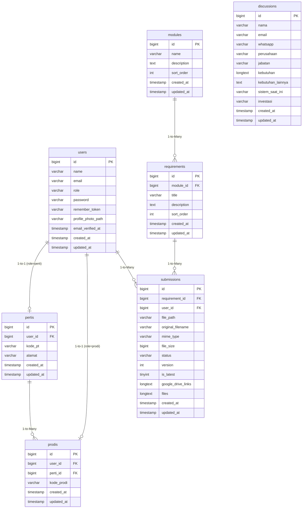

# BAB 3 PERANCANGAN SISTEM

## 3.1 Arsitektur Sistem (High-Level Architecture)

Aplikasi SiLADATA dikembangkan menggunakan framework PHP **Laravel** yang menerapkan pola arsitektur **Model-View-Controller (MVC)**. Pola MVC memisahkan logika aplikasi menjadi tiga komponen utama guna mempermudah pemeliharaan, pengembangan, dan skalabilitas kode:

1. **Model:** Mewakili struktur data dan aturan bisnis. Di SiLADATA, Model seperti `User`, `Module`, `Requirement`, `Submission`, dan `Discussion` berinteraksi langsung dengan basis data menggunakan Eloquent ORM (Object-Relational Mapping).
2. **View:** Mengatur bagaimana informasi disajikan kepada pengguna. Antarmuka SiLADATA dikembangkan menggunakan *Blade Templating Engine* Laravel yang dinamis dan terstruktur.
3. **Controller:** Bertindak sebagai jembatan yang menerima HTTP Request dari pengguna, memproses data melalui Model, dan mengembalikan respon berupa View atau file unduhan.

Keamanan akses di dalam aplikasi dijamin melalui lapisan **Middleware**. Setiap request yang masuk ke server akan diperiksa terlebih dahulu oleh middleware autentikasi bawaan Laravel (`auth`) untuk memastikan pengguna sudah login, kemudian diteruskan ke middleware otorisasi berbasis peran (`role:admin`, `role:perti`, `role:unit_kerja`) untuk memastikan pengguna hanya dapat mengakses rute yang menjadi haknya.

Berikut adalah visualisasi diagram blok arsitektur sistem SiLADATA yang digambarkan dengan kode **Graphviz DOT**:

---

> **Catatan Analisis Kesesuaian Diagram:**
>
> Berdasarkan pemeriksaan terhadap kode sumber aktual proyek, berikut hasil evaluasi terhadap diagram-diagram yang sudah dibuat:
>
> **✅ Diagram Blok Arsitektur** — Sudah sesuai. Komponen UI → Backend Laravel → Modul-modul → Database tergambar dengan benar. Keenam modul (Kelola Akun, Validasi Login, Dokumen Akreditasi, Diskusi, Kalkulator Progress, Cetak Data) sesuai dengan controller yang tersedia (`UserController`, `Auth`, `SubmissionController`, `DiscussionController`, `DashboardController`, `ReportController`).
>
> **✅ Activity Diagram (Workflow)** — Sudah sesuai. Alur 4 swimlane (prodi → universitas → admin → sistem) menggambarkan proses bisnis yang benar: pembuatan akun bertingkat (admin → perti → prodi) dan proses unggah dokumen yang diakhiri dengan pembaruan dashboard.
>
> **⚠️ ERD (Diagram Relasi Antar Tabel)** — Sebagian besar sudah benar, namun ada beberapa catatan:
> - Tabel `discussions` **tidak memiliki relasi foreign key** ke tabel lain (standalone form kontak). Ini sudah benar di ERD.
> - Relasi `submissions → requirements` dan `submissions → users` sudah benar (Many-to-One).
> - Relasi `pertis → users` dan `prodis → users` (One-to-One) sudah benar.
> - Relasi `prodis → pertis` sudah benar.
> - **Kolom `files` (LONGTEXT/JSON) dan `google_drive_links` (LONGTEXT/JSON)** di tabel `submissions` sudah ada di ERD. ✅

---

## 3.2 Workflow Sistem (Alur Proses Bisnis Pengumpulan Dokumen)

Proses pengumpulan dan versioning dokumen di dalam SiLADATA dirancang secara otomatis untuk meminimalisasi kesalahan koordinasi berkas. Alur proses bisnis pengumpulan dokumen dijabarkan langkah demi langkah sebagai berikut:

1. **Memilih Butir Persyaratan:** Pengguna Unit Kerja (Prodi) masuk ke menu pengumpulan berkas dan memilih butir kriteria/persyaratan akreditasi yang ingin dilengkapi.
2. **Pengisian Form & Unggah Berkas:** Pengguna memilih berkas dokumen lokal (misalnya format PDF) dari komputernya dan/atau memasukkan tautan Google Drive pada form unggahan. Setelah data lengkap, pengguna menekan tombol **Simpan**.
3. **Pengecekan Keberadaan Dokumen Sebelumnya:**
   - Sistem melakukan query ke tabel `submissions` untuk memeriksa apakah program studi tersebut sudah pernah mengunggah berkas untuk butir persyaratan yang sama sebelumnya.
   - **Jika Ya (Revisi Dokumen):** Sistem akan mengubah status dokumen lama dengan mengatur kolom status `is_latest` menjadi `false`. Hal ini mengarsipkan dokumen lama namun tidak menghapusnya dari riwayat basis data.
   - **Jika Tidak (Pengumpulan Baru):** Sistem melewati langkah pengarsipan versi lama.
4. **Penyimpanan Dokumen Baru:** Dokumen baru disimpan dengan kolom status `is_latest` bernilai `true`, status diset sebagai `Uploaded`, dan nomor kolom `version` otomatis dinaikkan satu angka dari versi sebelumnya (versi baru = versi lama + 1). File fisik disimpan dengan nama unik di storage lokal server.
5. **Pembaruan Dasbor & Rekapitulasi Progres:** Setelah berkas berhasil disimpan, query pada model `Submission` dengan relasi `latestForUnit` akan mendeteksi penambahan file. Persentase penyelesaian kriteria di halaman Dashboard Admin, Perti, dan Unit Kerja otomatis ter-update secara real-time.

Berikut adalah diagram alur proses pengunggahan dokumen hingga pembaruan dasbor yang digambarkan dengan kode **Graphviz DOT** (`rankdir=LR`):

```dot
digraph G {
  fontname="Helvetica,Arial,sans-serif"
  node [fontname="Helvetica,Arial,sans-serif" shape=box style=filled fillcolor="#F7FAFC" color="#CBD5E0" penwidth=1.5]
  edge [fontname="Helvetica,Arial,sans-serif" color="#4A5568" penwidth=1.2]
  
  rankdir=LR;
  
  // Nodes
  Start [label="Mulai" shape=ellipse fillcolor="#C6F6D5" color="#38A169"]
  SelectReq [label="Pilih Butir\nPersyaratan"]
  UploadForm [label="Unggah File /\nTautan Google Drive"]
  CheckDb [label="Pernah unggah\nsebelumnya?" shape=diamond fillcolor="#FEFCBF" color="#B7791F"]
  ArchiveOld [label="Set dokumen lama:\nis_latest = false"]
  SaveNew [label="Simpan dokumen baru:\nis_latest = true\nstatus = Uploaded\nversion = version + 1"]
  UpdateDashboard [label="Pembaruan Progres\nDasbor (Real-time)"]
  End [label="Selesai" shape=ellipse fillcolor="#FED7D7" color="#E53E3E"]
  
  // Connections
  Start -> SelectReq
  SelectReq -> UploadForm
  UploadForm -> CheckDb
  CheckDb -> ArchiveOld [label="Ya"]
  CheckDb -> SaveNew [label="Tidak"]
  ArchiveOld -> SaveNew
  SaveNew -> UpdateDashboard
  UpdateDashboard -> End
}
```

---

## 3.3 Class Diagram

Class Diagram menggambarkan struktur kelas-kelas dalam aplikasi SiLADATA berdasarkan pola **Model-View-Controller (MVC)** Laravel. Diagram ini merepresentasikan **Model Eloquent** beserta atribut, metode, dan relasi antar model yang diimplementasikan dalam kode sumber.

Terdapat **7 Eloquent Model** inti dalam sistem, ditambah **2 Enum** pendukung yang mendefinisikan nilai-nilai terkontrol untuk field `role` dan `status`:

---

## 3.4 Entity Relationship Diagram (ERD)

ERD menggambarkan skema basis data SiLADATA secara lengkap, termasuk seluruh atribut, tipe data, *primary key*, dan *foreign key* antar tabel. Basis data terdiri dari **7 tabel utama**.

### Keterangan Relasi Tabel

| Relasi | Tipe | Keterangan |
|--------|------|------------|
| `users` → `pertis` | One-to-One | Akun dengan role `perti` memiliki satu profil Perguruan Tinggi |
| `users` → `prodis` | One-to-One | Akun dengan role `prodi` memiliki satu profil Program Studi |
| `pertis` → `prodis` | One-to-Many | Satu Perguruan Tinggi dapat mengelola banyak Program Studi |
| `modules` → `requirements` | One-to-Many | Satu modul/kriteria akreditasi memiliki banyak butir persyaratan |
| `requirements` → `submissions` | One-to-Many | Satu butir persyaratan dapat memiliki banyak riwayat pengumpulan (versioning) |
| `users` → `submissions` | One-to-Many | Satu akun Prodi dapat mengunggah banyak dokumen |
| `discussions` | Standalone | Form kontak/diskusi tidak berelasi dengan tabel lain (data independen) |

### Catatan Implementasi Versioning Dokumen

Kolom `is_latest` (TINYINT) pada tabel `submissions` berfungsi sebagai penanda versi aktif. Ketika Prodi mengunggah dokumen baru untuk persyaratan yang sama, sistem secara otomatis mengubah `is_latest = 0` pada versi sebelumnya dan menyimpan dokumen baru dengan `is_latest = 1`. Hal ini memungkinkan sistem menyimpan **riwayat lengkap** seluruh versi unggahan tanpa menghapus data lama dari basis data.
