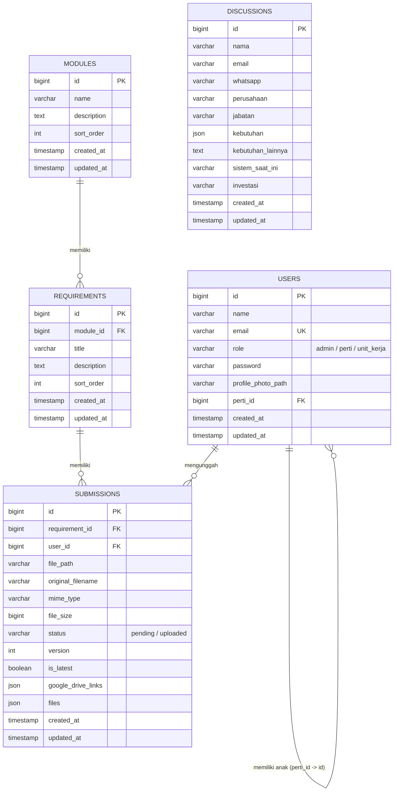

# Entity-Relationship Diagram (ERD) - SiLADATA

Berikut adalah kode Mermaid untuk **Entity-Relationship Diagram (ERD)** basis data SiLADATA yang dapat Anda salin dan tempel di **draw.io** (pilih menu *Arrange -> Insert -> Advanced -> Mermaid*).

