# Flowchart Unggah & Versioning Dokumen - SiLADATA

Berikut adalah kode Mermaid untuk **Flowchart Proses Bisnis Unggah & Versioning Dokumen** aplikasi SiLADATA yang dapat Anda salin dan tempel di **draw.io** (pilih menu *Arrange -> Insert -> Advanced -> Mermaid*).

```mermaid
graph LR
  %% Definisi Gaya
  classDef startEnd fill:#C6F6D5,stroke:#38A169,stroke-width:2px;
  classDef process fill:#EBF4FF,stroke:#3182CE,stroke-width:1.5px;
  classDef decision fill:#FEFCBF,stroke:#B7791F,stroke-width:1.5px;
  
  %% Nodes
  Mulai(["Mulai"]):::startEnd
  PilihReq["Unit Kerja memilih butir persyaratan"]:::process
  IsiForm["Mengisi Form (Pilih file lokal / tautan GDrive)"]:::process
  KlikKirim["Klik Simpan/Kirim"]:::process
  CekDokumen{"Apakah dokumen\nsebelumnya sudah ada?"}:::decision
  SetNonAktif["Ubah status dokumen lama:\nis_latest = false"]:::process
  SimpanBaru["Simpan berkas baru:\nis_latest = true\nstatus = Uploaded\nversion = version + 1"]:::process
  HitungProgres["Hitung ulang % Progres Modul Kriteria"]:::process
  UpdateDashboard["Dashboard Admin, Perti, & Prodi Ter-update"]:::process
  Selesai(["Selesai"]):::startEnd

  %% Hubungan Alur
  Mulai --> PilihReq
  PilihReq --> IsiForm
  IsiForm --> KlikKirim
  KlikKirim --> CekDokumen
  CekDokumen -->|Ya| SetNonAktif
  CekDokumen -->|Tidak| SimpanBaru
  SetNonAktif --> SimpanBaru
  SimpanBaru --> HitungProgres
  HitungProgres --> UpdateDashboard
  UpdateDashboard --> Selesai
```

