# Use Case Diagram - SiLADATA

Berikut adalah kode Mermaid untuk **Use Case Diagram** aplikasi SiLADATA yang dapat Anda salin dan tempel di **draw.io** (pilih menu *Arrange -> Insert -> Advanced -> Mermaid*).

```mermaid
graph TB
  %% Definisi Gaya Node Aktor
  classDef actor fill:#E2E8F0,stroke:#718096,stroke-width:2px,shape:circle;
  classDef usecase fill:#EBF4FF,stroke:#3182CE,stroke-width:1.5px,rx:20,ry:20;

  %% Aktor
  Admin["Aktor: Admin"]:::actor
  Perti["Aktor: Perti (Universitas)"]:::actor
  UnitKerja["Aktor: Unit Kerja (Prodi)"]:::actor
  Guest["Aktor: Tamu (Guest)"]:::actor

  subgraph Batasan Sistem [Sistem SiLADATA]
    %% Use Cases
    UC_Login["UC-01: Autentikasi & Kelola Profil"]:::usecase
    UC_UserCRUD["UC-02: Kelola Akun Pengguna (CRUD)"]:::usecase
    UC_ProdiCRUD["UC-03: Kelola Program Studi"]:::usecase
    UC_CriteriaCRUD["UC-04: Kelola Kriteria & Persyaratan"]:::usecase
    UC_Upload["UC-05: Unggah Dokumen (Single/Batch) & Link Google Drive"]:::usecase
    UC_Monitor["UC-06: Pantau Progres Unggahan Dokumen"]:::usecase
    UC_Preview["UC-07: Pratinjau & Unduh Dokumen"]:::usecase
    UC_ReportPDF["UC-08: Cetak Rekap Laporan PDF"]:::usecase
    UC_Landing["UC-09: Lihat Landing Page & Harga"]:::usecase
    UC_Discussion["UC-10: Isi Formulir Diskusi/Konsultasi"]:::usecase
    UC_ManageDisc["UC-11: Kelola Data Prospek Diskusi"]:::usecase
  end

  %% Relasi Aktor - Use Cases
  %% Admin
  Admin --> UC_Login
  Admin --> UC_UserCRUD
  Admin --> UC_CriteriaCRUD
  Admin --> UC_Monitor
  Admin --> UC_Preview
  Admin --> UC_ReportPDF
  Admin --> UC_ManageDisc

  %% Perti
  Perti --> UC_Login
  Perti --> UC_ProdiCRUD
  Perti --> UC_Monitor
  Perti --> UC_Preview
  Perti --> UC_ReportPDF

  %% Unit Kerja
  UnitKerja --> UC_Login
  UnitKerja --> UC_Upload
  UnitKerja --> UC_Monitor
  UnitKerja --> UC_ReportPDF

  %% Tamu
  Guest --> UC_Landing
  Guest --> UC_Discussion
```

